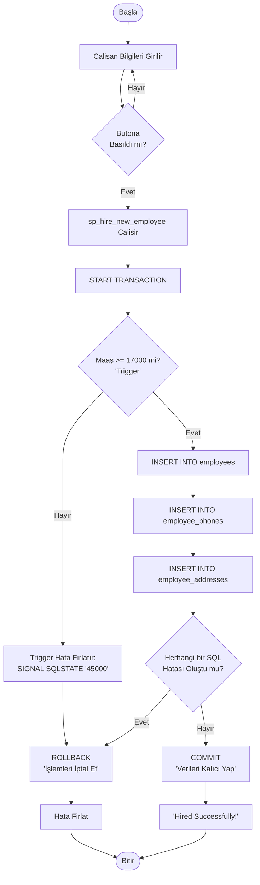
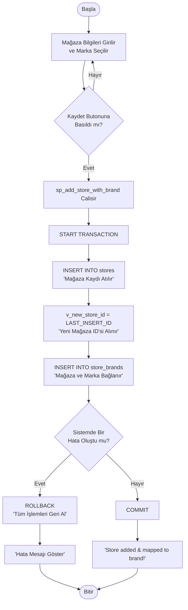
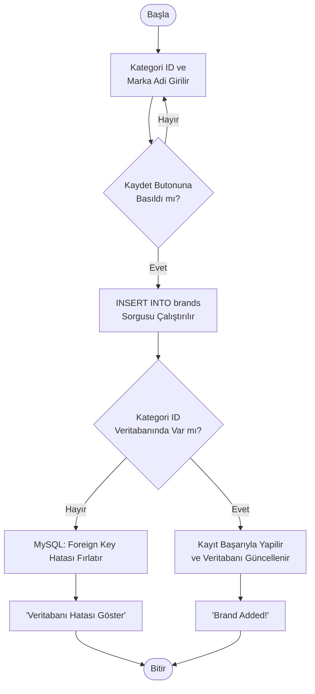
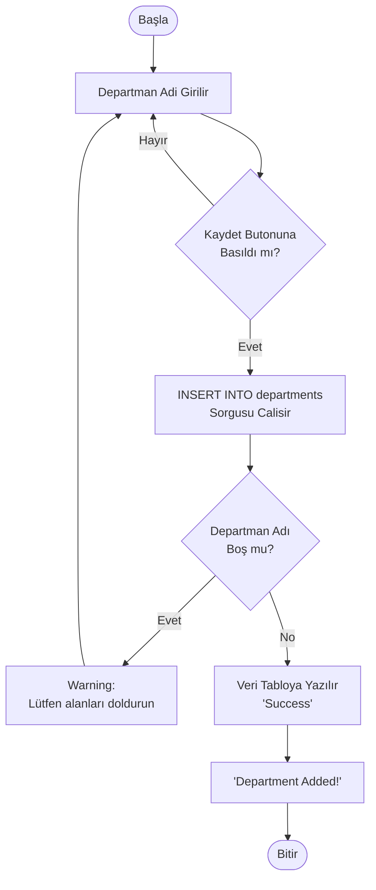

### 📌 İçindekiler
* [1. Proje Özeti ve Tanımı](#1-proje-özeti-ve-tanımı)
* [2. Geliştirme Ortamı ve Teknolojiler](#2-geliştirme-ortamı-ve-teknolojiler)
* [3. Projenin Kurulumu](#3-projenin-kurulumu)
* [4. Yazılım Mimarisi ](#4-yazılım-mimarisi)
* [5. Flowchart'lar](#5-flowchartlar)
* [6. ER Diyagramı](#veritabanı-er-diyagramı)
* [7. Arayüz](#arayüz)
* [8. Projenin Genel Yapısı](#8-projenin-genel-yapısı)
* [9. Referanslar](#9-referanslar)


## 1. Proje Özeti ve Tanımı
AVM Yönetim Otomasyonu, büyük ölçekli alışveriş merkezlerindeki operasyonel karmaşıklığı çözmek amacıyla geliştirilmiş ***veritabanı odaklı*** bir yönetim sistemidir. Bu proje; mağaza kiralama süreçleri, departman ve personel yönetimi, gelir-gider takibi ve bakım-onarım logları gibi süreçleri tek bir merkezden, tam veri bütünlüğü sağlayarak yönetmeyi hedefler.

## 2. Geliştirme Ortamı ve Teknolojiler
* **Veritabanı Yönetim Sistemi:** MySQL
* **Arayüz (Frontend) Dili:** Python 
* **Web Framework:** Streamlit
* **Veritabanı Sürücüsü:** `mysql-connector-python`
* **Veri İşleme:** Pandas
* **Geliştirme Araçları:** DBeaver, PyCharm, GitHub

## 3. Projenin Kurulumu
Projeyi (localhost) olarak çalıştırmak için aşağıdaki adımları sırasıyla izleyin:

**📌1. Projeyi Bilgisayarınıza İndirin:**

**📌2.Gerekli Python Kütüphanelerini Kurun:**
```bash
pip install -r requirements.txt
```
**📌3. Veritabanını Ayağa Kaldırın:**
MySQL (veya DBeaver) üzerinde boş bir veritabanı oluşturun ve proje dizinindeki database_setup.sql dosyasını çalıştırarak tüm tabloları, trigger, view ve test verilerini içeri aktarın.

**📌4. Veritabanı Bağlantı Ayarlarını Yapılandırın:**
Proje icinde .streamlit adında bir klasör oluşturup içine secrets.toml dosyası ekleyin ve kendi veritabanı bilgilerinizi girin:

```Ini, TOML
[mysql]
host = "localhost"
user = "root"
password = "kendi_mysql_sifreniz"
database = "db_adi"
```

**📌5. Uygulamayı Terminalden Başlatın:**
```Bash
streamlit run app.py
```

# 4. Yazılım Mimarisi

### 📌 Aşama 1: Gereksinim Analizi ve Modelleme
* Problemler analiz edildi.
* Varlıklar ve aralarındaki ilişkiler belirlendi.
* Çoka çok ilişkileri çözmek adına `store_brands` ve `employee_shifts` gibi ara tablolar tasarlandı.
* Veritabanının ER Diyagramı çıkarıldı.

### 📌 Aşama 2: Veritabanı Şemasının Hazırlanması
* Tablolar `CREATE TABLE` komutlarıyla MySQL (DBeaver) üzerinde ayağa kaldırıldı.
* Veri arama performansını optimize etmek için kritik sütunlara `INDEX` tanımlandı.
* Sorgu karmaşıklığını azaltmak için raporlama amaçlı `VIEW` yapıları oluşturuldu.
* İş kurallarını otomatikleştirmek için `TRIGGER` ve karmaşık veri manipülasyonları için `STORED PROCEDURE` kodları yazıldı.

### 📌 Aşama 3: Arayüz ve Entegrasyon
* `app.py` dosyası oluşturularak **Streamlit** ile arayüz yapıldı.
* `mysql.connector` kütüphanesi entegre edilerek **Python** ile **MySQL** arasında bağlantı kuruldu.


# Ekran Görüntüleri ve Diyagramlar

### 5. Flowchart'lar
#### 1-) Çalışan İşe Alma

#### 2-) Mağaza Ekleme


#### 3-) Marka Ekleme


#### 4-) Departman Ekleme


### 📌Veritabanı ER Diyagramı

```mermaid
erDiagram

    departments ||--o{ employees : "employs"
    employee_types ||--o{ employees : "categorizes"
    
    employees ||--o{ employee_phones : "owns"
    employees ||--o{ employee_addresses : "registered_at"
    employees ||--o{ employee_emails : "uses"
    
    employees ||--o{ employee_shifts : "has"
    shifts ||--o{ employee_shifts : "assigned_to"
    

    brand_categories ||--o{ brands : "have"
    

    brands ||--o{ store_brands : "sold_in"
    stores ||--o{ store_brands : "sells"
    
    stores ||--o{ employees : "employs_staff"
    stores ||--o{ maintenance_logs : "logged_for"
    employees ||--o{ maintenance_logs : "assigned_to"
    

    malls ||--o{ leases : "gets"
    stores ||--o{ leases : "bound_by"
    
    malls ||--o{ bills : "receives"
    stores ||--o{ bills : "incurs"
    bill_categories ||--o{ bills : "categorizes"
    
    malls ||--o{ billboards : "owns"
    stores ||--o{ billboards : "uses"
    
    malls ||--o{ revenues : "generates"
    income_categories ||--o{ revenues : "categorizes"


    
    malls {
        int mall_id PK
        string name
        string city
        string district
    }
    
    departments {
        int department_id PK
        string department_name
    }
    
    employee_types {
        int emp_type_id PK
        string emp_type_name
    }
    
    employees {
        string tc_id PK
        int department_id FK
        int emp_type_id FK
        int store_id FK
        string first_name
        string last_name
        float salary
        boolean is_active
        date hire_date
    }

    employee_phones {
        int phone_id PK
        string tc_id FK
        string phone_number
        string phone_type
    }

    employee_emails {
        int email_id PK
        string tc_id FK
        string email_address
        string email_type
    }

    employee_addresses {
        int address_id PK
        string tc_id FK
        string city
        string district
        string street
        string apartment_no
    }
    
    shifts {
        int shift_id PK
        time start_time
        time end_time
    }
    
    employee_shifts {
        string tc_id FK
        int shift_id FK
        date shift_date
    }
    
    brand_categories {
        int brand_category_id PK
        string br_category_name
    }
    
    brands {
        int brand_id PK
        int brand_category_id FK
        string brand_name
    }
    

    store_brands {
        int store_id FK
        int brand_id FK
    }
    
    stores {
        int store_id PK
        int mall_id FK
	string name
        int square_meters
        int floor
        boolean is_open
    }
    
    maintenance_logs {
        int maintenance_id PK
        int store_id FK
        string tc_id FK
        date maintenance_date
        string issue_desc
        boolean is_resolved
    }
    
    leases {
        int lease_id PK
        int store_id FK
        date start_date
        date end_date
        float monthly_rent
        boolean is_leases_active
    }
    
    bill_categories {
        int bill_category_id PK
        string bill_category_name 
    }
    
    bills {
        int bill_id PK
        int store_id FK
        int bill_category_id FK
        float amount
	date paid_at
        date issue_date
        date due_date
        boolean is_bill_paid 
    }
    
    billboards {
        int ad_id PK
        int store_id FK
        int floor
        float daily_rate 
        boolean is_bill_board_active
    }
    
    income_categories {
        int income_category_id PK
        string income_category_name
    }
    
    revenues {
        int revenue_id PK
        int mall_id FK
        int income_category_id FK
        float amount
        date revenue_date
    }
```


### 📌Arayüz


# 8. Projenin Genel Yapısı

Bu proje; **Normalizasyon kurallarına** göre normalize edilmiş ilişkisel bir **MySQL** veritabanı ile Python tabanlı **Streamlit** framework'ünü entegre eden modern bir **AVM Yönetim Otomasyonudur**. 

Sistem; veri bütünlüğünü ve güvenliğini arka planda çalışan:
* **Transaction** uyumlu **Stored Procedure**'ler, 
* Otomatik veri denetimi yapan **Trigger**'lar,
* Optimize edilmiş **Index** ve **View** yapıları 

ile doğrudan veritabanı seviyesinde korur. 

Sonuç olarak uygulama; departman/marka tanımlamalarından dinamik mağaza kurulumlarına ve personel işe alım süreçlerine kadar tüm operasyonel döngüyü sürdürülebilir bir yazılım mimarisiyle tek bir merkezden yönetir.

# 9. Referanslar

[Python Streamlit Tutorial](https://www.youtube.com/watch?v=o8p7uQCGD0U)

[Python ile MySQL Bağlantısı Örneği](https://dev.mysql.com/doc/connector-python/en/connector-python-example-connecting.html)

[ER Diyagramı (Mermaid) Tutorial](https://www.youtube.com/watch?v=KICPOYw1nck)


