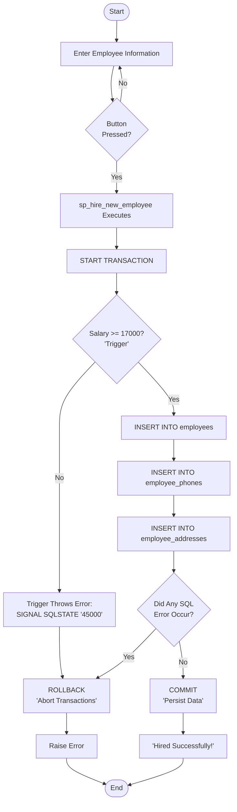
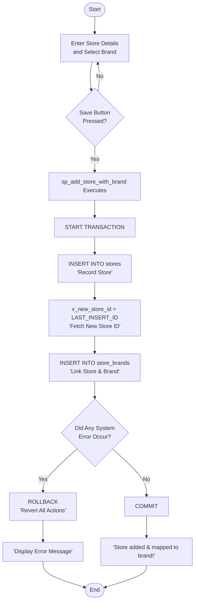
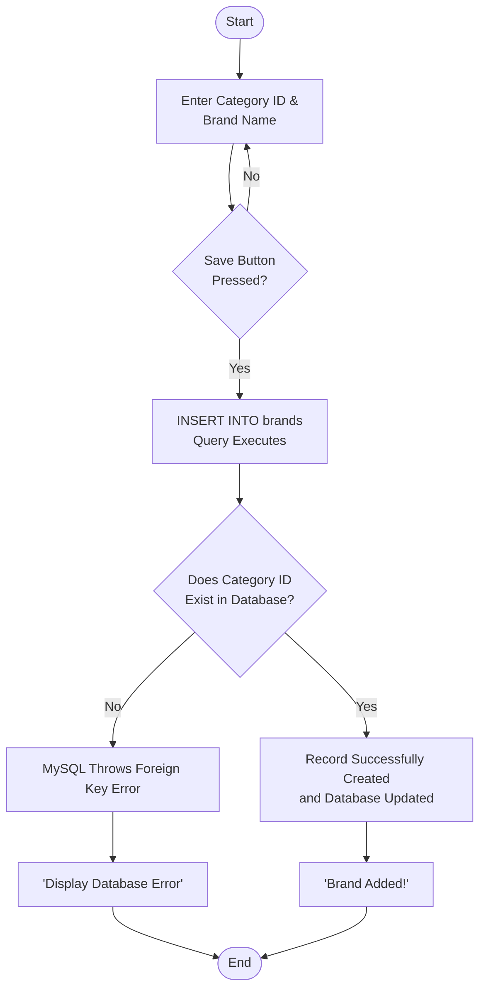
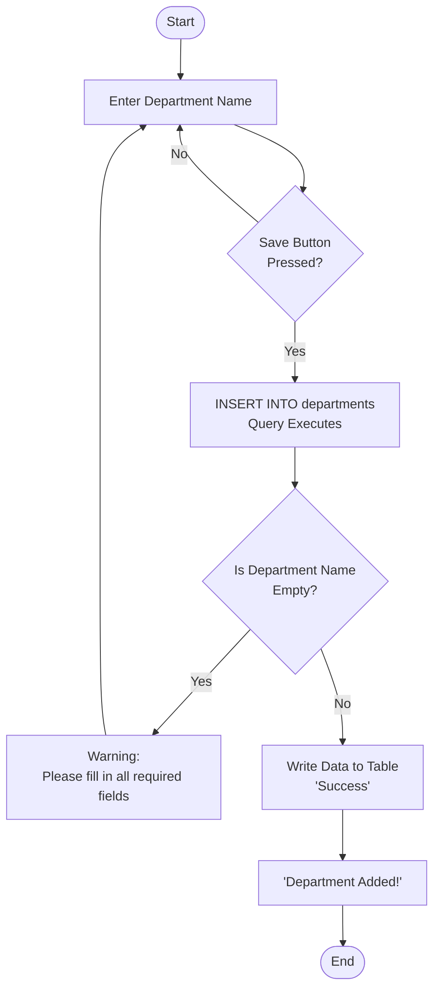

### 📌 Table of Contents
* [1. Project Overview & Description](#1-project-overview--description)
* [2. Development Environment & Technologies](#2-development-environment--technologies)
* [3. Project Setup](#3-project-setup)
* [4. Software Architecture](#4-software-architecture)
* [5. Flowcharts](#5-flowcharts)
* [6. ER Diagram](#database-er-diagram)
* [7. User Interface](#user-interface)
* [8. Project Structure & Overview](#8-project-structure--overview)

---

## 1. Project Overview & Description
The Shopping Mall Management Automation is a ***DATABASE-CENTRIC*** management system designed to streamline operational complexity in large-scale shopping malls. This project aims to manage processes such as store leasing, department and employee management, income-expense tracking, and maintenance logs from a single unified hub while ensuring total data integrity.

---

## 2. Development Environment & Technologies
* **Database Management System:** MySQL
* **Frontend Language:** Python
* **Web Framework:** Streamlit
* **Database Driver:** `mysql-connector-python`
* **Data Processing:** Pandas
* **Development Tools:** DBeaver, PyCharm, GitHub

---

## 3. Project Setup
Follow these steps sequentially to run the project locally (localhost):

**📌 1. Clone/Download the Repository:**
Clone or download the project files to your local computer.

**📌 2. Install Required Python Packages:**
```bash
pip install -r requirements.txt
```
**📌3. Initialize the Database:**
Create a blank database using MySQL (or DBeaver) and execute the database_setup.sql file located in the project root directory. This will import all tables, triggers, views, and test data.

**📌4. Configure Database Credentials:**
Create a `.streamlit` folder in the project directory, add a secrets.toml file inside it, and fill in your database credentials:

```Ini, TOML
[mysql]
host = "localhost"
user = "root"
password = "your_mysql_password"
database = "your_db_name"
```

**📌5. Launch the Application via Terminal:**
```Bash
streamlit run app.py
```

# 4. Software Architecture

### 📌 Phase 1: Requirements Analysis & Modeling

- Analyzed business domain problems and requirements.
- Defined core entities and their relationships.
- Designed junction tables such as store_brands and employee_shifts to resolve many-to-many relationships.
- Constructed the database ER Diagram.

### 📌 Phase 2: Database Schema Implementation

- Provisioned tables using CREATE TABLE DDL queries in MySQL (DBeaver).
- Defined INDEXes on critical columns to optimize data query performance.
- Built VIEWs to simplify analytical reporting and eliminate query complexity.
- Wrote TRIGGERs for business logic automation and STORED PROCEDUREs for complex data manipulation.

### 📌 Phase 3: Interface & Integration

- Built the frontend UI using Streamlit in `app.py.`
- Integrated `mysql-connector-python` to establish seamless connectivity between Python and MySQL.


# EScreenshots & Diagrams

### 5. Flowcharts
#### 1-) Hiring an Employee

```mermaid
flowchart TD
    A([Start]) --> B[Enter Employee Information]
    B --> C{Button\nPressed?}
    C -- No --> B
    C -- Yes --> D[sp_hire_new_employee Executes]
    D --> E[START TRANSACTION]
    E --> F{Salary >= 17000?\n'Trigger'}
    F -- No --> G[Trigger Throws Error:\nSIGNAL SQLSTATE '45000']
    G --> H[ROLLBACK\n'Abort Transactions']
    H --> I[Raise Error] --> Z([End])
    F -- Yes --> J[INSERT INTO employees]
    J --> K[INSERT INTO employee_phones]
    K --> L[INSERT INTO employee_addresses]
    L --> M{Did Any SQL\nError Occur?}
    M -- Yes --> H
    M -- No --> N[COMMIT\n'Persist Data']
    N --> O['Hired Successfully!'] --> Z
```
#### 2-) Adding a Store

```mermaid
flowchart TD
    A([Start]) --> B[Enter Store Details\nand Select Brand]
    B --> C{Save Button\nPressed?}
    C -- No --> B
    C -- Yes --> D[sp_add_store_with_brand Executes]
    D --> E[START TRANSACTION]
    E --> F[INSERT INTO stores\n'Record Store']
    F --> G[v_new_store_id = LAST_INSERT_ID\n'Fetch New Store ID']
    G --> H[INSERT INTO store_brands\n'Link Store & Brand']
    H --> I{Did Any System\nError Occur?}
    I -- Yes --> J[ROLLBACK\n'Revert All Actions']
    J --> K['Display Error Message'] --> Z([End])
    I -- No --> L[COMMIT]
    L --> M['Store added & mapped to brand!'] --> Z
```

#### 3-) Adding a Brand

```mermaid
flowchart TD
    A([Start]) --> B[Enter Category ID &\nBrand Name]
    B --> C{Save Button\nPressed?}
    C -- No --> B
    C -- Yes --> D[INSERT INTO brands\nQuery Executes]
    D --> E{Does Category ID\nExist in Database?}
    E -- No --> F[MySQL Throws Foreign Key Error]
    F --> G['Display Database Error'] --> Z([End])
    E -- Yes --> H[Record Successfully Created\nand Database Updated]
    H --> I['Brand Added!'] --> Z

```

#### 4-) Adding a Department

```mermaid
flowchart TD
    A([Start]) --> B[Enter Department Name]
    B --> C{Save Button\nPressed?}
    C -- No --> B
    C -- Yes --> D[INSERT INTO departments\nQuery Executes]
    D --> E{Is Department Name\nEmpty?}
    E -- Yes --> F[Warning:\nPlease fill in all required fields] --> B
    E -- No --> G[Write Data to Table\n'Success']
    G --> H['Department Added!'] --> Z([End])

```

### 📌Database ER Diagram


```mermaid
erDiagram

    departments ||--o{ employees : "employs"
    employee_types ||--o{ employees : "categorizes"
    
    employees ||--o{ employee_phones : "owns"
    employees ||--o{ employee_addresses : "registered_at"
    employees ||--o{ employee_emails : "uses"
    
    employees ||--o{ employee_shifts : "has"
    shifts ||--o{ employee_shifts : "assigned_to"
    

    brand_categories ||--o{ brands : "have"
    

    brands ||--o{ store_brands : "sold_in"
    stores ||--o{ store_brands : "sells"
    
    stores ||--o{ employees : "employs_staff"
    stores ||--o{ maintenance_logs : "logged_for"
    employees ||--o{ maintenance_logs : "assigned_to"
    

    malls ||--o{ leases : "gets"
    stores ||--o{ leases : "bound_by"
    
    malls ||--o{ bills : "receives"
    stores ||--o{ bills : "incurs"
    bill_categories ||--o{ bills : "categorizes"
    
    malls ||--o{ billboards : "owns"
    stores ||--o{ billboards : "uses"
    
    malls ||--o{ revenues : "generates"
    income_categories ||--o{ revenues : "categorizes"


    
    malls {
        int mall_id PK
        string name
        string city
        string district
    }
    
    departments {
        int department_id PK
        string department_name
    }
    
    employee_types {
        int emp_type_id PK
        string emp_type_name
    }
    
    employees {
        string tc_id PK
        int department_id FK
        int emp_type_id FK
        int store_id FK
        string first_name
        string last_name
        float salary
        boolean is_active
        date hire_date
    }

    employee_phones {
        int phone_id PK
        string tc_id FK
        string phone_number
        string phone_type
    }

    employee_emails {
        int email_id PK
        string tc_id FK
        string email_address
        string email_type
    }

    employee_addresses {
        int address_id PK
        string tc_id FK
        string city
        string district
        string street
        string apartment_no
    }
    
    shifts {
        int shift_id PK
        time start_time
        time end_time
    }
    
    employee_shifts {
        string tc_id FK
        int shift_id FK
        date shift_date
    }
    
    brand_categories {
        int brand_category_id PK
        string br_category_name
    }
    
    brands {
        int brand_id PK
        int brand_category_id FK
        string brand_name
    }
    

    store_brands {
        int store_id FK
        int brand_id FK
    }
    
    stores {
        int store_id PK
        int mall_id FK
	string name
        int square_meters
        int floor
        boolean is_open
    }
    
    maintenance_logs {
        int maintenance_id PK
        int store_id FK
        string tc_id FK
        date maintenance_date
        string issue_desc
        boolean is_resolved
    }
    
    leases {
        int lease_id PK
        int store_id FK
        date start_date
        date end_date
        float monthly_rent
        boolean is_leases_active
    }
    
    bill_categories {
        int bill_category_id PK
        string bill_category_name 
    }
    
    bills {
        int bill_id PK
        int store_id FK
        int bill_category_id FK
        float amount
	date paid_at
        date issue_date
        date due_date
        boolean is_bill_paid 
    }
    
    billboards {
        int ad_id PK
        int store_id FK
        int floor
        float daily_rate 
        boolean is_bill_board_active
    }
    
    income_categories {
        int income_category_id PK
        string income_category_name
    }
    
    revenues {
        int revenue_id PK
        int mall_id FK
        int income_category_id FK
        float amount
        date revenue_date
    }
```
### 📌User-interface


# 8. Project Structure & Overview

This project is a modern, **database-driven Shopping Mall Management System** that integrates a relational **MySQL** database normalized according to **Database Normalization rules** with a Python-based **Streamlit** framework.

The system enforces data integrity and security directly at the database level utilizing:
* **Transaction**-compliant **Stored Procedures**,
* **Triggers** for automated data auditing,
* Optimized **Indexes** and analytical **Views**.

As a result, the application seamlessly handles the entire operational lifecycle—from department and brand management to dynamic store setups and employee recruitment processes—via a sustainable and scalable software architecture.


